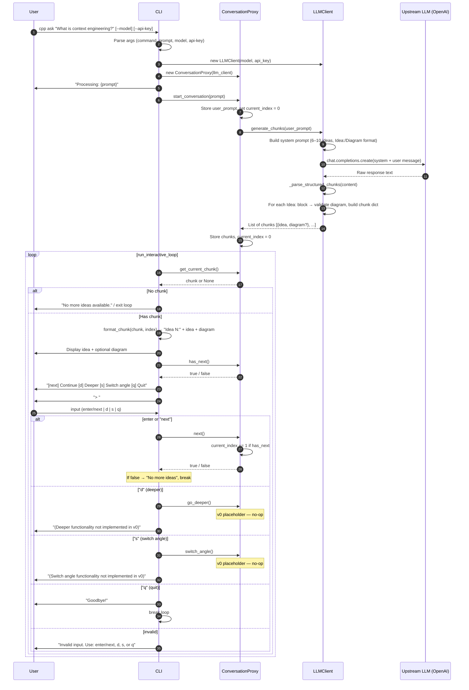

# CPP Sequence Diagram

Mermaid sequence diagram showing how the **Conversational Pacing Proxy (CPP)** works from CLI invocation through the interactive loop.

## Legend

| Actor | Role |
|-------|------|
| **User** | Runs `cpp ask "…"` and interacts via prompts |
| **CLI** | `cli.py`: argparse, `run_interactive_loop`, formatting, I/O |
| **ConversationProxy** | `proxy.py`: session state, chunk storage, `next` / `go_deeper` / `switch_angle` |
| **LLMClient** | `llm.py`: system prompt, single OpenAI call, parse Idea:/Diagram → chunks |
| **Upstream LLM** | OpenAI API; returns structured text, proxy does not stream |

## Design notes

- **Exactly one** upstream LLM call per user prompt (`start_conversation` → `generate_chunks`).
- Proxy stores the full chunk list and reveals **one chunk per turn**; `next()` just advances `current_index`.
- Controls (`[next]`, `[d]`, `[s]`, `[q]`) are shown every turn; `d` and `s` are placeholders in v0.
